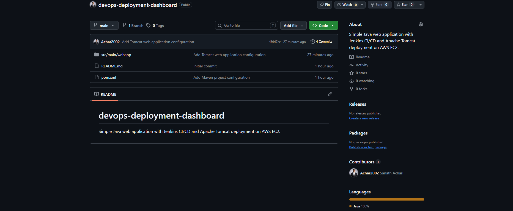
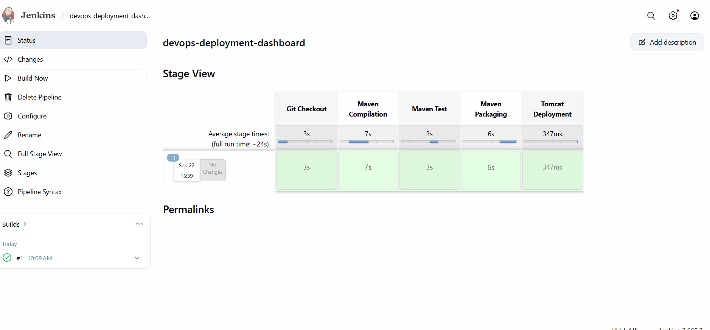
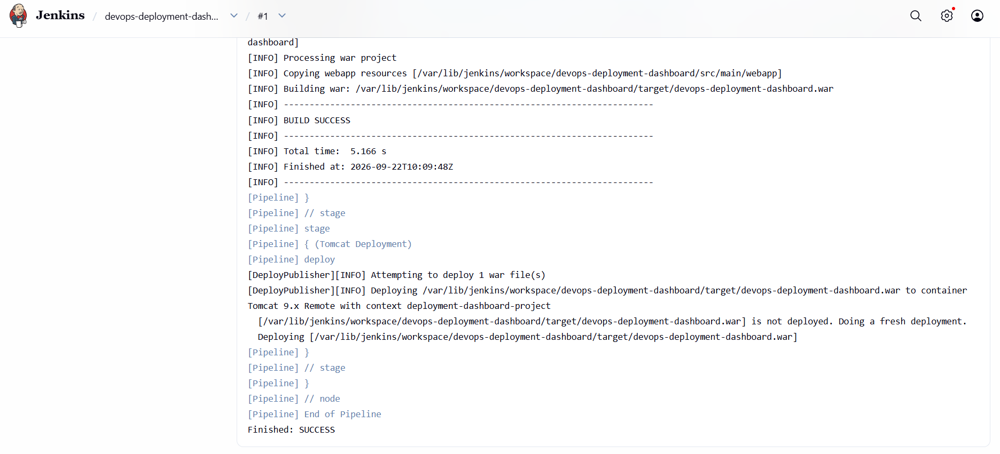
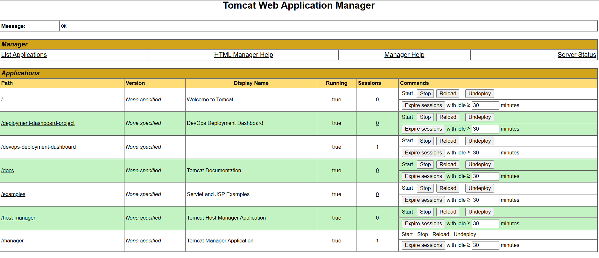
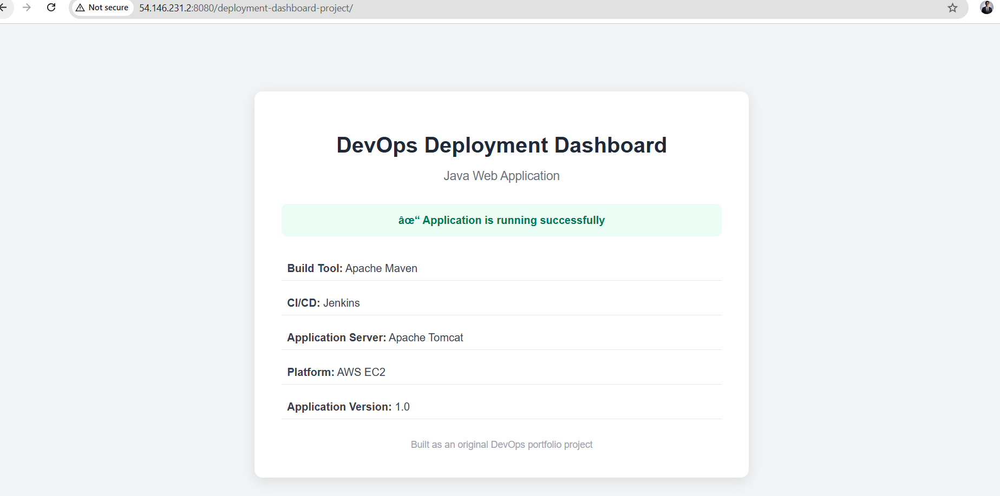

# devops-deployment-dashboard
Simple Java web application with Jenkins CI/CD and Apache Tomcat deployment on AWS EC2.

# DevOps Deployment Dashboard

A Java web application deployed on Apache Tomcat using an automated CI/CD pipeline built with Jenkins, Maven, GitHub, and AWS EC2.

The project demonstrates the complete workflow from source-code management to automated application deployment.

---

## Project Overview

This project was built to demonstrate a practical DevOps CI/CD workflow for a Java web application.

The application source code is maintained in GitHub. Jenkins automatically checks out the source code, builds and packages the application using Maven, and deploys the generated WAR file to Apache Tomcat running on an AWS EC2 instance.

### CI/CD Workflow

```text
Developer
    |
    v
  GitHub
    |
    | Webhook
    v
  Jenkins
    |
    +---- Checkout
    |
    +---- Maven Build
    |
    +---- Test
    |
    +---- Package WAR
    |
    +---- Deploy
    |
    v
 Apache Tomcat
    |
    v
 AWS EC2
    |
    v
Running Web Application
```

---

## Technologies Used

| Technology     | Purpose                    |
| -------------- | -------------------------- |
| Java 17        | Application development    |
| JSP            | Web interface              |
| Maven          | Build and WAR packaging    |
| Jenkins        | CI/CD automation           |
| GitHub         | Source code management     |
| Apache Tomcat  | Application server         |
| AWS EC2        | Deployment environment     |
| GitHub Webhook | Automated build triggering |

---

## Application

The application is a simple Java web application called **DevOps Deployment Dashboard**.

The dashboard displays the deployment environment and technologies used in the project.

It also contains a Java Servlet endpoint that can be used to verify that the application is running correctly on Tomcat.

### Application Endpoints

```text
/
```

Displays the deployment dashboard.

```text
/status
```

Displays the application deployment status through the Java Servlet.

---

## Project Structure

```text
devops-deployment-dashboard/
│
├── docs/
│   └── screenshots/
│       ├── 01-github-repository.png
│       ├── 02-jenkins-pipeline-success.png
│       ├── 03-jenkins-console-output.png
│       ├── 04-tomcat-deployment.png
│       └── 05-live-application.png
│
├── src/
│   └── main/
│       ├── java/
│       │   └── com/
│       │       └── devops/
│       │           └── dashboard/
│       │               └── DeploymentServlet.java
│       │
│       └── webapp/
│           ├── index.jsp
│           └── WEB-INF/
│               └── web.xml
│
├── pom.xml
├── Jenkinsfile
├── .gitignore
└── README.md
```

---

## Maven Build

Maven is used to compile the Java application and package it as a WAR file.

The project uses:

```text
Packaging: WAR
Java: 17
```

Build command:

```bash
mvn clean package
```

The generated artifact is:

```text
target/devops-deployment-dashboard.war
```

---

## Jenkins CI/CD Pipeline

The Jenkins pipeline automates the application delivery process.

### Pipeline Stages

1. **Checkout**

   * Retrieves the latest source code from GitHub.

2. **Build**

   * Uses Maven to compile the Java application.

3. **Test**

   * Executes the configured Maven test lifecycle.

4. **Package**

   * Creates the deployable WAR file.

5. **Deploy**

   * Deploys the WAR file to Apache Tomcat.

6. **Verification**

   * The deployed application can be accessed through the Tomcat server.

---

## Deployment Environment

The application is deployed on an AWS EC2 instance running Apache Tomcat.

The deployment flow is:

```text
GitHub
   ↓
Jenkins
   ↓
Maven
   ↓
WAR File
   ↓
Apache Tomcat
   ↓
AWS EC2
```

---

## GitHub Webhook

A GitHub webhook is configured to trigger the Jenkins pipeline when changes are pushed to the repository.

This removes the need to manually start the Jenkins job for every source-code change.

```text
Git Push
   ↓
GitHub Webhook
   ↓
Jenkins
   ↓
Pipeline
   ↓
Build
   ↓
Deploy
```

---

## Deployment Screenshots

### 1. GitHub Repository

Shows the source-code repository and project structure.



### 2. Jenkins Pipeline Success

Shows the successful Jenkins CI/CD pipeline execution.



### 3. Jenkins Console Output

Shows the Maven build and deployment execution.



### 4. Tomcat Deployment

Shows the application deployed on Apache Tomcat.



### 5. Live Application

Shows the deployed DevOps Deployment Dashboard running successfully.



---

## Key DevOps Concepts Demonstrated

* Git-based source code management
* Maven build automation
* WAR packaging
* Jenkins CI/CD pipeline
* GitHub webhook integration
* Automated Tomcat deployment
* AWS EC2 deployment
* Application verification
* Basic deployment troubleshooting

---

## Future Improvements

The project can be extended with:

* SonarQube code-quality analysis
* OWASP dependency scanning
* Docker containerization
* Kubernetes deployment
* Prometheus and Grafana monitoring
* Automated rollback
* Blue-green deployment
* Infrastructure provisioning using Terraform

---

## Author

**DevOps Deployment Dashboard**

Built as a hands-on DevOps portfolio project demonstrating CI/CD automation using Jenkins, Maven, Tomcat, GitHub, and AWS EC2.
